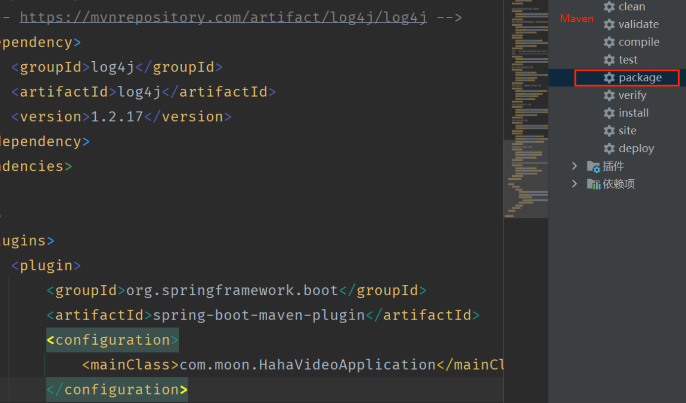

# Getting Started

### SpringBoot Project

tech-stack:

SpringBoot, Maven, Swagger (Doc), MySQL, JPA, Thymeleaf (template), Druid

---

TODO:

- [X] Docker deployment
- [X] Build `.jar`

<details open>
  
<summary>Build JAR</summary>
  
Maven: `pom.xml` add `maven-jar-plugin` configuration：
```xml
<plugin>
   <groupId>org.apache.maven.plugins</groupId>
   <artifactId>maven-jar-plugin</artifactId>
   <version>VERSION</version>
   <configuration>
       <mainClass>com.moon.HahaVideoApplication</mainClass>
   </configuration>
</plugin>
```



Test: `java -jar /path/to/moon-0.0.1-SNAPSHOT.jar`
  
</details>

<details open>
<summary>Docker Deployment</summary>

1. Create Dockerfile (make sure it is in the same folder with JAR)

  ```dockerfile
  FROM java:8
  
  MAINTAINER moonjay
  
  COPY moon-0.0.1-SNAPSHOT.jar moon.jar
  
  CMD java -jar /moon.jar
  
  EXPOSE 8888 
  ```

2. run `docker build -t moon .`

3. View Docker image, then
   ```bash
   docker run -d -p 8888:8889 --name MOON_hahaVideo moon
   ```
   
4. View Running Containers
   ```bash
   docker ps -a
   ```

</details>
